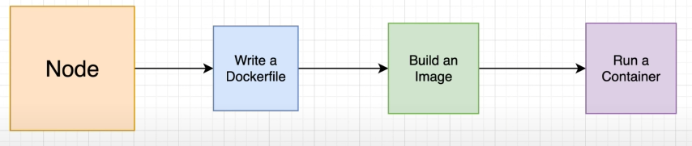

# Steps to build and run Docker

in general, the steps are:



1. develop the project (for a simple example, you can download an example of a node-express server from [GitHub here](https://github.com/harblaith7/Docker-Crash-Course/tree/main/01-Building-an-Image/start) )
2. write Dockerfile and .dockerignore

- The Dockerfile is essentially the build instructions to build the image.
- Dockerfile consists of specific [commands](https://www.simplilearn.com/tutorials/docker-tutorial/docker-commands) that guide you on how to build a specific Docker image.
- dockerignore - Using this file, you can specify ignore rules and exceptions from these rules for files and folders, that won’t be included in the build context and thus won’t be packed into an archive and uploaded to the Docker server.

```docker
FROM node:alpine

WORKDIR = /usr/app

COPY package.json .

RUN npm install

COPY . .

CMD [ "npm", "run", "start"]
```

```docker
node_modules
Dockerfile
```

3. run the script to build the image with the command:

```bash
docker build -t express-app .
```

- we can see that we built the image successfully with the command:

```bash
docker images
```


- or we can view our images at the Docker Desktop application:


4. after building the image, we can run it in order to build the container with the command:

```bash
docker run -d --name express-container -p 3333:3333 express-app
```

we can see that we ran the container successfully with the command:

```bash
docker ps -a
```


- or we can view our containers at the Docker Desktop application:


# Volumes

in order to connect the same resources between the container and the REAL application.

for example, sharing the same src folder between the two.


<aside>
💡 come in handy especially if we want to run a container that includes any kind of DB because if the data in the DB container get deleted we wouldn’t have any option to restore the lost data.

</aside>

<br />

- to add Volumes to our container we just need to add the command:

**-v** [the absolute path of our app] : [the path to the container resources]

- for example:

```bash
docker run -v ${pwd}:/use/app --name simple-react-with-volumes -it -p 3000:3000 react-app
```

- Since we want to use the container version of the “node_modules” folder, we configured another volume: **-v /usr/app/node_modules**
- the full script will be:

```bash
docker run -v ${pwd}:/use/app -v /usr/app/node_modules --name simple-react-with-volumes -it -p 3000:3000 react-app
```

for the full documentation for [dockerizing a react app click here](https://mherman.org/blog/dockerizing-a-react-app/)

<aside>
⛔ in Window, there is a problem and we can’t use Volumes for HMR. HMR works only in macOS or Linux for the time of this writing

</aside>

# Docker compose

Compose is a tool for defining and running multi-container Docker applications. With Compose, you use a YAML file to configure your application’s services. Then, with a single command, you create and start all the services from your configuration.

Using Compose is basically a three-step process:

1. Define your app’s environment with a `Dockerfile` so it can be reproduced anywhere.
2. Define the services that make up your app in `docker-compose.yml` so they can be run together in an isolated environment.
3. Run `docker compose up` and the [Docker compose command](https://docs.docker.com/compose/#compose-v2-and-the-new-docker-compose-command) starts and runs your entire app.

an example of a Docker-compose YAML file (for react app):

```yaml
**version: "2.3"
services:
  frontend_service:
    build:
      context: .
      dockerfile: Dockerfile
    container_name: react-app-c
    ports:
      - "3000:3000"
    stdin_open: true
    tty: true**
```
## the difference between bare metal vs VM vs dockers


